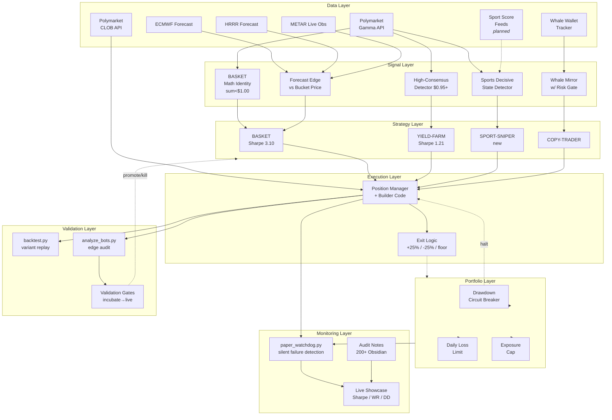

# SigForge Architecture

> *How data, signals, execution, and monitoring fit together — from
> raw market feeds to attributed live volume.*

This document is the system map. For algorithmic detail of individual
strategies, see [`../strategies/`](../strategies/). For the validation
methodology that drives strategy lifecycle, see [`METHODOLOGY.md`](METHODOLOGY.md).

---

## System diagram

The diagram below renders natively on GitHub. It shows the seven layers
of the stack, with data flowing top to bottom and feedback flowing
bottom to top.



---

## Layer-by-layer description

### 1. Data layer — external feeds

| Source | Cadence | Purpose |
|---|---|---|
| ECMWF (European Centre forecast) | Hourly | Weather forecast — input for forecast-edge strategies |
| HRRR (NOAA US-only model) | Hourly | Cross-validation of ECMWF, US cities |
| METAR (live airport observations) | 15-30 min | Real-time temperature for late-resolve detection |
| Polymarket Gamma API | On-demand | Market metadata, prices, volume |
| Polymarket CLOB API | On-demand | Order book, order placement |
| Whale wallet tracker | 60s | Mirror specialist trader entries |
| Sport score feeds (planned) | 60s | Real-time game state for SPORT-SNIPER |

Data ingestion is decoupled from signal generation — each feed runs as
its own pm2 process. If one feed dies, others keep working.

### 2. Signal layer — edge detection

Each signal generator transforms raw data into a buy/skip decision:

- **BASKET math identity** — flags weather events where `sum(asks) < $1.00`.
- **Forecast edge** — compares forecast confidence with bucket pricing
  to identify mis-priced buckets (used by ЛЬОДНИК variants, currently
  in iterative refinement).
- **High-consensus detector** — flags markets at $0.95+/$0.99+ with
  acceptable volume and resolution timeline.
- **Sports decisive state** — detects `sportsMarketType` markets where
  game state suggests near-certain outcome (lead size, period, time).
- **Whale mirror w/ risk gate** — filters whale trades by minimum size,
  market end-date, exposure cap.

### 3. Strategy layer — trade-generating bots

Strategies consume signals and emit trade intentions. Each strategy is
isolated:
- own pm2 process
- own state file
- own capital allocation
- own backtest baseline

Failure of one strategy does not affect others.

### 4. Execution layer — order placement

`Position Manager` owns the actual order submission. Two responsibilities:

- **Builder Code attribution** — every order tagged with the
  `builderCode` field so volume attributes back to Polymarket.
- **Exit logic** — encoded stops (-25%), targets (+25%), and floors
  (hold to resolution if bid below entry × 0.50). No mental stops, no
  human override.

### 5. Portfolio layer — risk hierarchy

Three independent caps. Any one breach pauses scope:

| Cap | Scope | Trigger | Action |
|---|---|---|---|
| Per-trade size | Single trade | Position too large | Reject |
| Daily loss limit | Strategy | Day's PnL < threshold | Halt new entries |
| Drawdown circuit breaker | Strategy or account | -15% from peak | Halt entirely |

Defense in depth — see [METHODOLOGY § 4](METHODOLOGY.md).

### 6. Validation layer — offline replay

The validation layer runs on demand, not on a hot path:

- **`backtest.py`** — replays hypothetical strategy variants against
  archived data in 1 second.
- **`analyze_bots.py`** — reads all live trade logs, computes Sharpe /
  WR / DD across strategies for the public showcase.
- **Validation gates** — quantitative criteria for promotion between
  lifecycle phases (paper → candidate → live → scale/kill).

### 7. Monitoring layer — observability

- **`paper_watchdog.py`** — pm2 process scanning every 5 minutes.
  Detects: process down, restart loop, balance drained, state stale,
  HALT flag.
- **Live showcase** — http://18.178.69.19/showcase.html. Real-time
  Sharpe / win rate / drawdown / PnL per strategy.
- **Audit notes** — 200+ Obsidian markdown files auto-synced to AWS
  via cron. Every strategic decision logged with hypothesis, expected
  impact, rollback plan.

---

## Hot vs cold paths

The architecture deliberately separates two timing classes:

**Hot path (sub-minute):** signal → strategy → execution → portfolio cap.
This must be fast and reliable. Failure modes: missed opportunity,
stuck position, blown circuit breaker.

**Cold path (hourly to daily):** validation, backtest, audit notes,
showcase, alerts. This must be thorough but not time-critical. Failure
modes: missed insight, slow learning loop.

This separation is why the watchdog runs on its own schedule (5 min) —
not bound to any one strategy's loop, so it catches strategies that
got stuck *in* their hot path.

---

## Process inventory (representative, current)

```
Data feeds (cold):
  weather-fcst, weather-mkt, weather-metar, weather-resolver

Strategies (hot):
  arb-paper, cointrick-paper, sport-sniper,
  esports-copy, weather-copy, coldmath-bot

Variants (paper experiments):
  cm-v9-pricefilter, cm-v10-tiered, cm-v11-loose
  (cm-v1, v6, v8 stopped — empirically losing)

Infrastructure:
  master-node, weather-vault-writer, weather-redeem,
  paper-watchdog, coldmath-safety

Frontend:
  sigforge (Express backend, brain.html + showcase.html)
```

Total ~25 active pm2 processes, ~5 stopped/archived. Fits comfortably on
a single AWS Lightsail Tokyo node.

---

## Why this layering matters for the grant

A single-strategy retail bot is a script. SigForge is **infrastructure**:

1. Each layer can be replaced independently (swap data source, swap
   signal generator, swap execution backend).
2. Each layer is independently testable (data feeds stub, signal logic
   pure-function, execution mockable).
3. Each layer is independently observable (watchdog covers all of them).
4. Adding a new strategy is one new pm2 process plus a one-page deep-dive
   doc — not a fork-and-rewrite.

This is what "infrastructure-first" means in practice, and why grant
funding accelerates the whole portfolio rather than a single bot.

---

## See also

- [`METHODOLOGY.md`](METHODOLOGY.md) — validation framework that drives layer 6.
- [`ROADMAP.md`](ROADMAP.md) — 30/60/90 day plan and grant fund usage.
- [`../strategies/`](../strategies/) — per-strategy deep-dives.
- [`../tools/`](../tools/) — paper_watchdog and backtest source.
