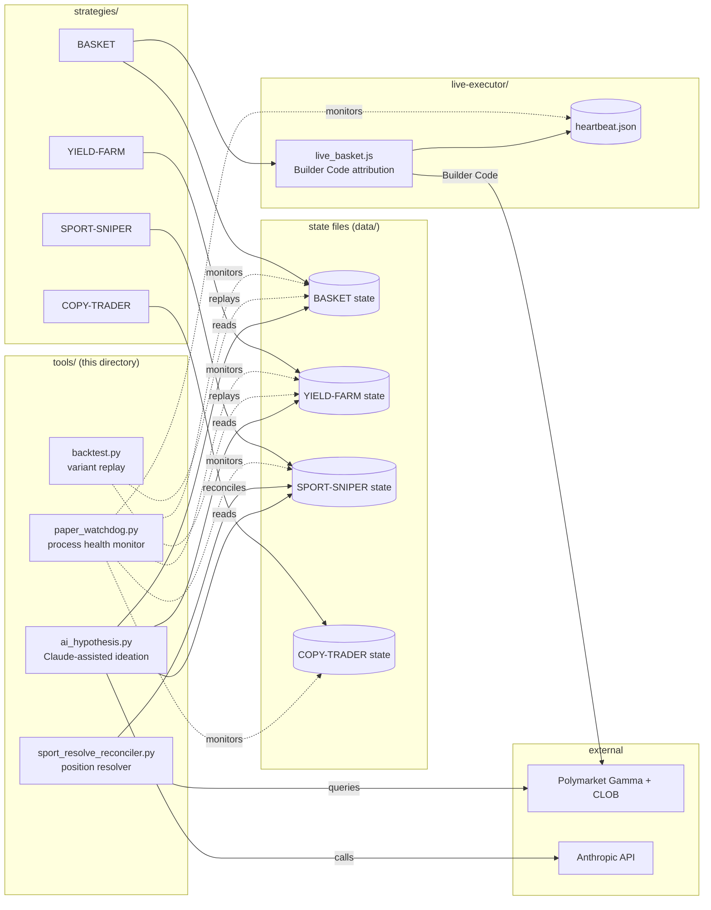

# SigForge — Tools

Infrastructure tooling that supports the strategy validation lifecycle.
Each tool runs as an independent process; together they form the operational
backbone of the SigForge bot stack.

---

## Tooling map



The dashed arrows are observation paths — tooling reads state but never
writes it. Solid arrows are write paths (strategies and the live
executor). This separation means tooling cannot accidentally corrupt
strategy state, and a buggy tool is operationally safe to run.

---

## `paper_watchdog.py` — Process health monitor

Detects silent failures across the bot stack:
- PM2 process down or stuck in restart loop
- Balance drained rapidly (configurable threshold)
- State file stale (no update for too long)
- HALT flag created (drawdown circuit breaker fired)

Sends Telegram alerts with deduplication. Falls back to log-only mode if
`SIGFORGE_TELEGRAM_BOT_TOKEN` is not set.

**Why this exists:** On 2026-05-06 we caught a stop-loss bug on the coldmath
bot only because of manual inspection — the patched function was the wrong
one (hourly scan instead of 10-minute monitor). The watchdog now monitors
silent failures across the entire stack so this class of bug cannot
accumulate undetected.

Run:
```
python3 paper_watchdog.py
```

Configure via environment (see module docstring for full list).

---

## `backtest.py` — Strategy variant replay

Reads archived market files (each containing position + resolution + snapshot
timeline) and replays hypothetical strategy variants against them. Computes
per-variant metrics (trades, win rate, total PnL, max drawdown, Sharpe).

**Philosophy:** Used for **falsification**, not pattern fishing. Running 50
random variants and picking the best is overfitting. Running one specific
variant proposed by the thesis and confirming the edge holds is validation.

See [`../docs/METHODOLOGY.md`](../docs/METHODOLOGY.md) section 6 for the
philosophical framing.

Run:
```
python3 backtest.py /path/to/markets [/path/to/markets2 ...]
python3 backtest.py --strategy combined_patches /path/to/markets
```

Adding a new strategy variant: define a function with signature
`(market: dict, position: dict) -> {"entry": bool, ...}`, register it in the
`STRATEGIES` dict, re-run.

---

## `sport_resolve_reconciler.py` — Sport-sniper position resolver

Closes the operational loop for `SPORT-SNIPER` (and any moneyline-style
strategy with the same state shape). The strategy bot only opens positions —
without this reconciler, every trade stays "open" forever, blocking realized
PnL accounting and capping `MAX_OPEN_USD` exposure as more games resolve.

What it does each cycle (cron, hourly):
- Read state file, find positions with `status="open"`.
- For each, query Gamma `?id=<mid>&closed=true`. If the market is closed and
  one outcome priced >=0.99, that outcome is the resolved winner.
- Mark our position `won` (resolve_value = shares × $1) or `lost` ($0).
- Update state file in-place; append immutable row to reconcile log.
- Print summary: `won=+N lost=-M open=K err=E` plus all-time WR/PnL/ROI.

**First production run (2026-05-07):** 20 of 22 open positions resolved.
20 won, 0 lost, 100% WR, +$11.28 realized PnL on $200 spend (ROI +5.64%,
Sharpe-per-trade 2.41). Two positions still open pending late-night games.

Run manually:
```
python3 sport_resolve_reconciler.py
```

Configure via env (`SF_DATA_DIR`, `SF_STATE_FILE`, `SF_LOG_FILE`,
`SF_GAMMA_URL`, `SF_HTTP_TIMEOUT`, `SF_USER_AGENT`) — see module docstring.

---

## `ai_hypothesis.py` — hypothesis generation via Claude

Reads a SigForge trades JSONL file, distills it to the fields most useful
for hypothesis generation (win rate, ROI, price-band distribution, sample
trades), and asks Claude to propose 3 candidate hypotheses ranked by
falsifiability.

**Why this exists:** The methodology (`docs/METHODOLOGY.md` section 1)
requires every strategy or patch to start with a written hypothesis.
Writing a hypothesis that survives backtesting is the hard part — most
retail traders skip it entirely. This tool helps by listing alternatives
the operator might not have considered, each tied to a concrete
falsification test.

The tool is intentionally an *idea generator*, not an *answer giver*. The
output is a list of candidates; the operator picks one, runs the proposed
falsification, and either kills it or promotes it through the validation
gates. No hypothesis ships to live trading on the basis of a Claude
response alone.

Run:
```
ANTHROPIC_API_KEY=sk-ant-...  python3 ai_hypothesis.py path/to/trades.jsonl
python3 ai_hypothesis.py --dry-run path/to/trades.jsonl  # preview prompt
```

Configurable via env (`ANTHROPIC_MODEL`, `HTTP_TIMEOUT_SEC`,
`MAX_TRADES`). See module docstring for full list.

---

## Why these are separate from `/strategies/`

The `/strategies/` directory contains **trade-generating** code — bots that
buy and sell. The `/tools/` directory contains **infrastructure** that
supports those strategies but does not itself trade. Separation matters for:

- **Capital risk attribution.** Tools cannot lose money. Strategies can.
- **Deployment cadence.** Tools update slowly; strategies iterate fast.
- **Testing surface.** Tool failure is operational; strategy failure is
  capital-impacting.

This mirrors the SigForge methodology: separate concerns, attribute outcomes.
